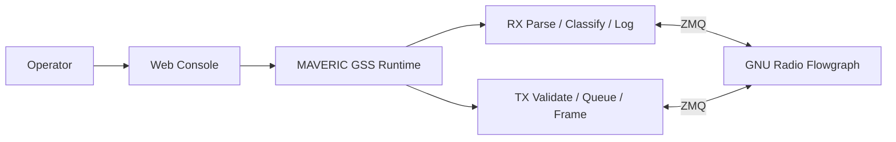
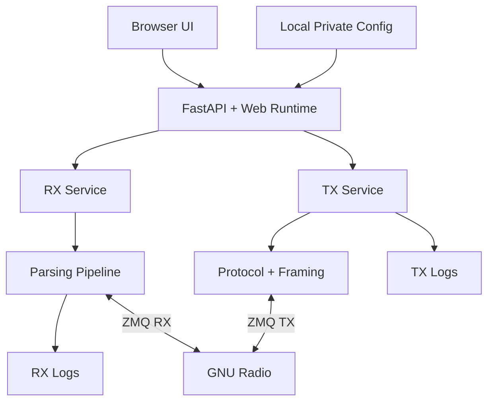

# MAVERIC Ground Station Software

MAVERIC Ground Station Software is the ground-station runtime and operator console for the **MAVERIC CubeSat**, developed at the **University of Southern California (USC)** through the **Space Engineering Research Center (SERC)**.

It is a web-based system for live telemetry monitoring, command uplink operations, and operator-facing session control across the full ground-station workflow.

MAVERIC GSS brings together packet transport, protocol parsing, uplink queue management, browser-based operations, and local session logging into one integrated operational layer between the radio stack and the operator.

This repository is public-facing by design: the implementation is visible, the architecture is documented, and the operationally sensitive mission-specific files stay local.

## Ground Segment at a Glance

- **Mission Role:** ground-station runtime for the MAVERIC CubeSat
- **Institutional Context:** developed at USC through SERC
- **Primary Interface:** browser-based operator console
- **Core Functions:** receive telemetry, review packets, validate commands, execute uplink queues, record sessions
- **System Position:** operational layer between GNU Radio and the operator

---

## Ground Station Runtime

For the MAVERIC CubeSat mission, MAVERIC GSS is not only a dashboard layered on top of radio data. It is the operational middle layer between the radio stack and the operator.

It receives decoded traffic from GNU Radio over ZMQ, parses and classifies packets through a shared protocol pipeline, exposes that state live to browser clients, validates outbound commands against a local schema, frames those commands for transmission, and records both RX and TX activity into local session logs.

In practice, it acts as the control surface and runtime coordinator for the station.



---

## What It Delivers

### Live Downlink Operations

- real-time packet visibility
- parsed routing and command detail
- duplicate detection and uplink-echo tagging
- stale-link and health visibility
- local RX session logging

### Controlled Uplink Operations

- validated command entry
- persistent TX queue management
- delay items and guard confirmations
- framed transmit payload generation
- local TX session logging

### Operator Workflow

- browser-based split RX/TX console
- replay and log review
- runtime config editing against local private YAMLs
- status, alarms, and session-state feedback

---

## Capability View

```mermaid
flowchart TD
    GSS["MAVERIC GSS"]
    GSS --> RXC["RX Operations"]
    GSS --> TXC["TX Operations"]
    GSS --> RTC["Runtime Services"]
    GSS --> UIC["Operator UI"]

    RXC --> RX1["Live packet stream"]
    RXC --> RX2["Packet detail views"]
    RXC --> RX3["Duplicate / echo handling"]
    RXC --> RX4["RX session logs"]

    TXC --> TX1["Command validation"]
    TXC --> TX2["Queue persistence"]
    TXC --> TX3["Delay + guard controls"]
    TXC --> TX4["Framing pipeline"]

    RTC --> RT1["FastAPI backend"]
    RTC --> RT2["WebSocket streaming"]
    RTC --> RT3["ZMQ integration"]
    RTC --> RT4["Local config loading"]

    UIC --> UI1["RX panel"]
    UIC --> UI2["TX panel"]
    UIC --> UI3["Alarm strip"]
    UIC --> UI4["Log viewer + replay"]
```



---

## System Architecture

MAVERIC GSS is structured around four cooperating layers:

1. **Browser UI**
   The operator-facing interface for live RX/TX work.

2. **Web Runtime**
   FastAPI app, WebSocket endpoints, runtime state, queue control, and API routes.

3. **Shared Core Library**
   Protocol handling, parsing, transport helpers, framing, and logging.

4. **Radio Integration**
   GNU Radio flowgraph connected over RX/TX ZMQ sockets.



---

## Implementation

### Web Runtime

The entrypoint is `MAV_WEB.py`, but the main web runtime lives under `mav_gss_lib/web_runtime/`.

That layer owns:

- startup lifecycle
- runtime state
- REST API routes
- RX and TX websocket endpoints
- queue and session handling
- browser session-token/origin checks

### Shared Core Library

The protocol and transport implementation lives in `mav_gss_lib/`.

Key modules:

- `protocol.py`
  Command format, schema loading, command validation, node/type resolution
- `parsing.py`
  RX pipeline, packet classification, counters, duplicate tracking, log-record generation
- `transport.py`
  ZMQ helpers and transport integration
- `logging.py`
  RX/TX session logging
- `ax25.py`
  AX.25 framing support
- `golay.py`
  ASM+Golay framing support
- `config.py`
  Local config load/save and protocol object application

### Operator Console

The web UI lives under `mav_gss_lib/web/`.

It provides:

- RX packet list and detail views
- TX queue construction and history
- alarm/status feedback
- config editing UI
- log browsing and replay flows
- keyboard-driven operator controls

---

## Operational Use

### Live Pass Monitoring

The operator runs the flowgraph, opens the browser console, and watches decoded traffic arrive in real time. MAVERIC GSS parses and surfaces packet structure, warnings, routing fields, and link health so the session can be monitored as an operational stream rather than raw transport output.

### Command Queue Execution

The operator builds an uplink sequence through validated command entry, optional delay items, and guard confirmations. The runtime persists queue state locally, frames each command for the selected uplink mode, and sends payloads back to GNU Radio over the TX ZMQ path.

### Session Review and Replay

Saved RX and TX logs can be revisited for inspection, replay, and workflow review. This makes MAVERIC GSS useful not only during live operations, but also as a record of what happened during a session.

---

## Codebase Layout

```text
MAV_WEB.py                  Web runtime entrypoint
MAV_IMG.py                  Image downlink utility

mav_gss_lib/
    ax25.py
    config.py
    golay.py
    imaging.py
    logging.py
    parsing.py
    protocol.py
    transport.py
    tui_common.py
    tui_rx.py
    tui_tx.py

    config/
        maveric_gss.example.yml
        maveric_commands.example.yml

    web/
        package.json
        src/
        public/

    web_runtime/
        api.py
        app.py
        runtime.py
        rx.py
        security.py
        services.py
        state.py
        tx.py

backup_control/
    MAV_RX.py
    MAV_TX.py
```

---

## Public Repository Policy

This repository is meant to show the software without exposing live station operations.

Tracked in git:

- source code
- web UI code
- public-safe examples
- documentation

Kept local and untracked:

- real `maveric_gss.yml`
- real `maveric_commands.yml`
- decoder configuration used in live operations
- logs
- generated command files
- local workspace/tooling state

---

## Startup

To bring up a local instance:

```bash
python3 -m venv .venv
source .venv/bin/activate
pip install -r requirements.txt
cp mav_gss_lib/config/maveric_gss.example.yml mav_gss_lib/config/maveric_gss.yml
cp mav_gss_lib/config/maveric_commands.example.yml mav_gss_lib/config/maveric_commands.yml
npm --prefix mav_gss_lib/web install
npm --prefix mav_gss_lib/web run build
python3 MAV_WEB.py
```

Your GNU Radio flowgraph should already be running and exposing the expected RX/TX ZMQ endpoints before launching the web runtime.

For maintainer-focused setup, architecture, and adaptation guidance, see `docs/maintainer_handoff.md`.

For the long-term implementation spec covering transport/protocol separation, mission-adapter boundaries, adaptive UI contracts, and the phased migration plan, see `docs/architecture_migration_spec.md`.

---

## Legacy Control Path

Legacy Textual applications remain under `backup_control/` for fallback and historical continuity:

```bash
python3 backup_control/MAV_RX.py --nosplash
python3 backup_control/MAV_TX.py --nosplash
```

The primary direction of the codebase is the modular web runtime and browser operator console.

---

## Direction

MAVERIC GSS is evolving toward a cleaner separation between:

- protocol logic
- runtime services
- operator interface
- local operational state
- session review and replay

The public repository is structured to reflect that direction while keeping mission-specific operational data out of version control.

## Mission Adapter Boundary

The current mission boundary is `mav_gss_lib/mission_adapter.py`.

That adapter now owns the mission-facing RX/TX semantics that future missions are most likely to change:

- frame classification from GNU Radio metadata
- outer-frame normalization
- inner packet parsing
- mission integrity checks
- duplicate fingerprint rules
- uplink-echo classification
- TX command payload build and argument validation

`mav_gss_lib/parsing.py` should only orchestrate packet flow and tracking state. It should not need to know where the command payload starts, whether CSP is present, or which fields define a duplicate for a given mission.

For a future SERC mission, the intended adaptation order is:

1. update config and command schema
2. confirm whether the current mission adapter still matches the mission packet layout
3. replace adapter-owned parsing/encoding behavior only if the new mission differs materially
4. leave transport, runtime shell, logging, and most UI code alone unless operator workflow truly changes

This is deliberate future-proofing, not a plugin framework. The goal is one clear replacement seam for mission truth.

## Testing

The default test suite covers the reusable runtime and protocol path:

```bash
pytest -q
```

One heavier end-to-end GNU Radio flowgraph test is intentionally opt-in:

```bash
MAVERIC_FULL_GR=1 pytest -q -rs tests/test_ops_golay_path.py
```

That test requires a working GNU Radio environment with the expected `gr-satellites` flowgraph dependencies. If it skips, the reusable code still may be fine; the skip usually means the local GNU Radio test environment is incomplete rather than that the Python runtime logic failed.
